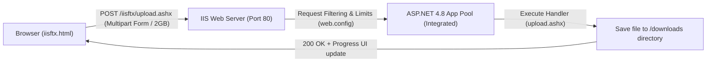

# IIS File Transfer Configuration Plan

## Goal Description
Configure Microsoft Internet Information Services (IIS) to support large file uploads (up to 2 GB) through a web interface (`iisftx.html`) communicating with an ASP.NET handler (`upload.ashx`). The setup requires configuring `web.config`, setting up required IIS Windows features (ASP.NET 4.8 / Handler Mappings), setting NTFS permissions on the `downloads` storage folder, and providing an automated configuration script to apply IIS settings.



---

## Current State & Diagnostics
- **Static files work**: `http://localhost/iisftx/iisftx.html` returns `200 OK`.
- **ASP.NET handler blocked**: Requesting `http://localhost/iisftx/upload.ashx` currently returns `HTTP 404.3 - Not Found` because the ASP.NET feature/handler mapping for `.ashx` is not yet enabled in IIS.
- **Folder Permissions**: `C:\inetpub\wwwroot\iisftx\downloads` currently only has `ReadAndExecute` permissions for `IIS_IUSRS`. It lacks `Modify`/`Write` permissions, which would cause an access denied error when saving uploaded files.
- **`web.config`**: Currently specifies `maxRequestLength` and `maxAllowedContentLength`, but lacks `requestValidationMode`, default document configuration, and explicit handler definitions.

---

## User Review Required

> [!IMPORTANT]
> Enabling IIS Windows Features (ASP.NET 4.8) and setting NTFS permissions on `C:\inetpub\wwwroot\iisftx\downloads` require Windows Administrator privileges. An automated PowerShell setup script (`setup-iis.ps1`) and batch launcher (`setup-iis.bat`) will be provided so you can run the setup with elevated permissions in a single step.

---

## Proposed Changes

### 1. Web Application Configuration (`web.config`)
#### [MODIFY] [web.config](file:///c:/inetpub/wwwroot/iisftx/web.config)
- Configure `<httpRuntime>` with `maxRequestLength="2097152"` (2 GB), `executionTimeout="3600"`, and `requestValidationMode="2.0"`.
- Configure `<requestFiltering>` with `maxAllowedContentLength="2147483648"`.
- Add `<defaultDocument>` to automatically serve `iisftx.html` when navigating to `http://localhost/iisftx/`.
- Ensure handler mapping fallback configuration for `upload.ashx` if required.

```xml
<?xml version="1.0" encoding="utf-8"?>
<configuration>
  <system.web>
    <!-- maxRequestLength is in KB. 2097152 KB = 2 GB. executionTimeout is in seconds (3600 = 1 hour) -->
    <httpRuntime maxRequestLength="2097152" executionTimeout="3600" requestValidationMode="2.0" targetFramework="4.8" />
    <compilation debug="false" targetFramework="4.8" />
  </system.web>
  <system.webServer>
    <security>
      <requestFiltering>
        <!-- maxAllowedContentLength is in bytes. 2147483648 bytes = 2 GB -->
        <requestLimits maxAllowedContentLength="2147483648" />
      </requestFiltering>
    </security>
    <defaultDocument enabled="true">
      <files>
        <clear />
        <add value="iisftx.html" />
      </files>
    </defaultDocument>
  </system.webServer>
</configuration>
```

---

### 2. ASP.NET Upload Handler (`upload.ashx`)
#### [MODIFY] [upload.ashx](file:///c:/inetpub/wwwroot/iisftx/upload.ashx)
- Add robust `try...catch` error handling with detailed diagnostic logging for permission or disk errors.
- Sanitize file names to prevent directory traversal (`Path.GetFileName`).
- Ensure proper response status codes and text formatting for client consumption.

---

### 3. Frontend Client (`iisftx.html`)
#### [MODIFY] [iisftx.html](file:///c:/inetpub/wwwroot/iisftx/iisftx.html)
- Add drag-and-drop file upload zone support.
- Add real-time upload speed (MB/s) and time remaining calculation.
- Add support for multiple file selection / batch queue.
- Improve error messaging display.

---

### 4. Automated IIS Setup & Permissions Script
#### [NEW] `setup-iis.ps1` & `setup-iis.bat`
Create an administrative setup script that automatically performs:
1. **Enable Windows Features**:
   - `IIS-WebServerRole`
   - `IIS-WebServer`
   - `IIS-CommonHttpFeatures`, `IIS-StaticContent`, `IIS-DefaultDocument`
   - `IIS-ApplicationDevelopment`
   - `IIS-ASPNET45`, `IIS-NetFxExtensibility45`
   - `IIS-ISAPIExtensions`, `IIS-ISAPIFilter`
2. **Grant Folder Permissions**:
   - Grant `IIS_IUSRS` and `IUSR` Modify/Write rights on `C:\inetpub\wwwroot\iisftx\downloads`.
3. **Configure IIS Application**:
   - Ensure the `iisftx` folder is converted to an IIS Application under `Default Web Site` assigned to `DefaultAppPool` (.NET 4.0 Integrated pipeline).
4. **Restart IIS Service** (`iisreset`).

---

## Verification Plan

### Automated / CLI Verification
1. **Windows Features Check**: Verify ASP.NET 4.5+ is enabled.
2. **NTFS ACL Check**: Run `icacls "C:\inetpub\wwwroot\iisftx\downloads"` to verify `BUILTIN\IIS_IUSRS:(OI)(CI)(M)`.
3. **HTTP Smoke Test via PowerShell**:
   ```powershell
   # Test default document
   Invoke-WebRequest -Uri "http://localhost/iisftx/" -UseBasicParsing

   # Test file upload via multipart POST
   $filePath = "$env:TEMP\test_upload.txt"
   "Hello from IIS File Transfer test!" | Out-File -FilePath $filePath
   $response = Invoke-RestMethod -Uri "http://localhost/iisftx/upload.ashx" -Method Post -Form @{ file = Get-Item $filePath }
   $response
   ```
4. **File Persistence Check**: Verify `C:\inetpub\wwwroot\iisftx\downloads\test_upload.txt` exists and matches the uploaded content.

### Manual Verification
1. Open browser to `http://localhost/iisftx/`.
2. Select or drag a small test file and click **Transfer**.
3. Verify live progress bar, completion message, and history log.
4. Check that the file appears in `C:\inetpub\wwwroot\iisftx\downloads`.
